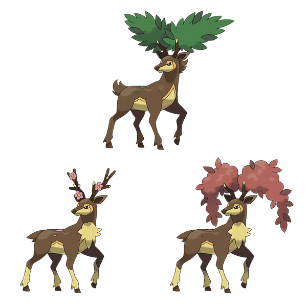
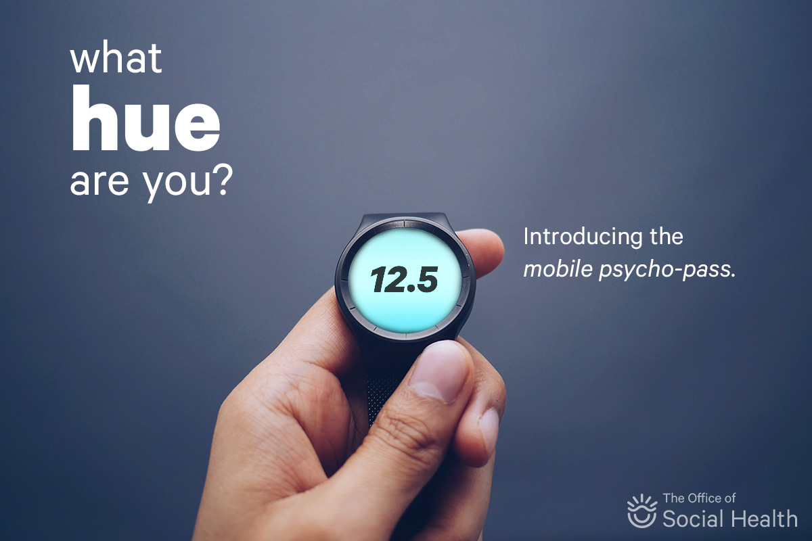

### Version 0.1.0

This is a series of iPython notebooks for "Machine Learning 101" workshops.

Concepts are taught via two "stories", one for natural phenomena and one for artificial phenomena:

- a deer researcher
- a journalist in a [Psycho-Pass](https://en.wikipedia.org/wiki/Psycho-Pass)-esque world (or the real world now, I guess, cf. [Sesame Credit](http://qz.com/519737/all-chinese-citizens-now-have-a-score-based-on-how-well-we-live-and-mine-sucks/))

All data is generated via the `data/data_generation.ipynb` notebook to be tailored for the workshop.

## Setup

    pip install -r requirements.txt
    jupyter notebook

Then look in the `notebooks` folder.

---

