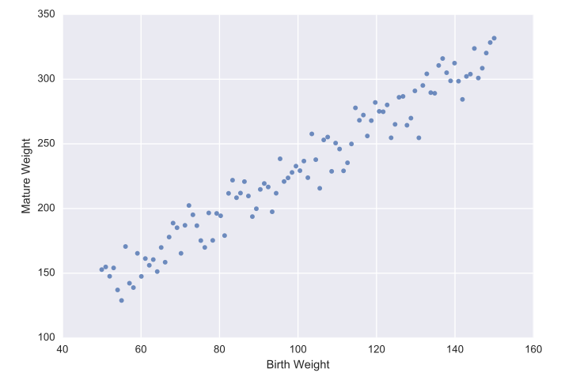

# ML101

Francis Tseng (@frnsys)

---

let's start setting up b/c it will probably take awhile ⏳

    git clone https://github.com/frnsys/ml101
    cd ml101/altai
    pip install -r requirements.txt
    jupyter notebook

---

## what we'll cover today

- intuitively understand what machine learning does
- walkthrough two simple examples to introduce important concepts
    - linear learning
    - neural networks
- connect what we've learned to deeper examples:
    - recurrent neural networks
    - reinforcement learning

---

machine learning is a massive field!

we'll only be able to go into depth with a couple techniques, but the intuition you'll gain will make it easier to approach other parts.

---

the techniques we'll learn today are behind neat things like...

- [AlphaGo](https://deepmind.com/alpha-go) (beat world Go champion 4-1)
- AIs that can [play Atari games](https://www.youtube.com/watch?v=Vr5MR5lKOc8) as well as or better than humans 🕹
- [autonomous trick helicopter](https://www.youtube.com/watch?v=VCdxqn0fcnE)
- [prose suggestions](https://www.robinsloan.com/notes/writing-with-the-machine/)
- algorithmic text generation, e.g. [Fullest House](http://fullest.house/)
- imitating author styles, e.g. [Finnegan's Wake](https://www.countbayesie.com/blog/2015/5/24/writing-finnegans-wake-with-a-recurrent-neural-net)
- algorithmic music generation, e.g. [sheet music](https://medium.com/dbrs-innovation-labs/in-his-novel-galatea-2-2-e9d11c9b7c2a#.xd00cremz)
- [computational Chinese poetry](http://www.anthology.aclweb.org/D/D14/D14-1074.pdf)
- [autonomous driving robots](https://youtu.be/-YMfJLFynmA?t=345)
- [a pancake-flipping robot](https://www.youtube.com/watch?v=W_gxLKSsSIE)
- [simulations of economies](http://frnsys.com/hosny/)

---

to do that kind of stuff, we'll learn how to use these tools:

1. [`scikit-learn`](http://scikit-learn.org/stable/) for supervised linear learning
2. [`keras`](http://keras.io/) for neural networks
3. [`pandas`](http://pandas.pydata.org/) for handling data
4. [`matplotlib`](http://matplotlib.org/) and [`seaborn`](https://web.stanford.edu/~mwaskom/software/seaborn/) for visualizing data

---

## assumptions

- you have some python 🐍 experience
- you know a bit of high school 🏫 math

---

## What do you know about machine learning? 💬

---

ok, so what the heck is machine learning doing? what is it even for?

## 💻🤔

---

## ✨~modeling the world~✨

---

we can model phenomena, both natural and artificial, as mathematical functions

# y ⟶ $f(x)$
# 💫 ⟶ $f(⚛)$
# 💹 ⟶ $f(📰)$
# 🎼 ⟶ $f(🎼)$
# 🎼 ⟶ $f(🎼,😶)$

---

which basically means we want to find a mapping of some **input** to some **output** in a way that reflects reality

---

machine learning is all about finding these mappings (i.e. **functions**) from **data** (which is assumed to reflect reality)

---

so why would you even want to learn one of these functions?

---

once you learn your mystery function, there's so much you can do with it:

- predict things
- automate things/make decisions
- gain insight into a system
- emulate a system

---

let's work through a concrete example to better understand this.

(this example may feel a bit disconnected, but I promise it will make the more interesting stuff easier to understand)

---

you're a fashion company and you want to create a line of on-demand perfect-fit pants.

the existing waist-size system is imprecise and inconsistent, and you're convinced you can figure out the exact centimeter waste size based on someone's weight alone.

i.e. we want to _predict_ someone's waist size given their weight.

---

to put this another way, you want to find a function that maps someone's weight (input) to a waist size (output).

$$
\text{size} = f(\text{weight})
$$

what is $f$??

---

how could we come up with such a function? 🤔

there are _infinitely_ many of them

---

first, we can collect some data and try to narrow things down.

---

we go out and survey a bunch of people, getting their weight and then measuring their waist size.

---

we plot the data:

what does it look like?

---

(kind of like a line)

---

remember that a line can be described in the general form of

$$
y = mx + b
$$

---

if we assume that a line fits this data well, and it looks like it does, then we only need to look at functions that take the form $y=mx+b$.

---

remember that lines vary depending on what the values of $m$ and $b$ are:

we say that $m$ and $b$ _parameterize_ the function ($m$ and $b$ are called "parameters").

---

these parameters define a unique function, so what we're _actually_ looking for is values for $m$ and $b$.

once we get those, we just plug them in and we get our function 🙃

---

but...because $m$ and $b$ could literally be _any_ value, there are also infinite possible lines!

---

anyway, we've at least narrowed things down to the point where we can "guess-and-check" different values of $m$ and $b$.

we can eyeball it and seems like if the resulting line is a good fit and stop when we're content.

(to the notebook 🗒)

---

that was pretty tedious...

what's the best way to deal with tedious processes?

---

(have a computer do it)

# 🤖

---

this is in essence what "machine learning" is:

### _using computers to learn functions from observations (data)_

---

so now let's try this with a computer

(example in notebook 🗒)

---

now that we have this function, a customer can give us their weight and we can tailor our pants size to them!

---

that worked pretty well didn't it? can we just stop there? why do we even need 🎉~neural networks~🎉?

---

let's consider one more example problem.

we have some data about how many pants we sell throughout the year. we've been pretty wasteful with our production - we'll make a lot of pants some months and sell very few.

it would be nice if we could _predict_ how many pants we'd sell that month so we produce only that much.

---

(example in notebook 🗒)

---

essentially every machine learning technique learns what these parameters are, and one of what differentiates algorithms is the approach with which they do this learning.

another main differentiator is what _kinds_ of functions the algorithm can learn - some can only learn lines, while others can learn much fancier functions. 💪🏽

---

the example problems we have seen are called __regression__ problems - they involve predicting some continuous value.

but there is another type of problem - __classification__ - that also comes up a lot. in these problems, we want to predict which category some input belongs to.

---

with classification problems, we are still trying to find a function, but instead of having it fit "on top" of the data, we want it to weave through the different categories in the data.

---

(example in notebook 🗒)

---

one particularly fun kind of neural network is a _recurrent neural network_ (RNN)

these are great for modeling _sequences_, e.g. text📝, music🎶, time series🕐, and so on

---

examples:

- [prose suggestions](https://www.robinsloan.com/notes/writing-with-the-machine/)
- algorithmic text generation, e.g. [Fullest House](http://fullest.house/)
- imitating author styles, e.g. [Finnegan's Wake](https://www.countbayesie.com/blog/2015/5/24/writing-finnegans-wake-with-a-recurrent-neural-net)
- algorithmic music generation, e.g. [sheet music](https://medium.com/dbrs-innovation-labs/in-his-novel-galatea-2-2-e9d11c9b7c2a#.xd00cremz)
- [computational Chinese poetry](http://www.anthology.aclweb.org/D/D14/D14-1074.pdf)

---

the problem we'll look at is something like:

given the character sequence "fuc", what character do you think comes next?

---

what if I told you the text that preceded it was "my favorite color is"?

---

("fuchsia")

---

you were very unlikely to get the right answer given just "fuc" - you needed the preceding _context_.

if instead I had given the context of "what the", you'd have guessed something different.

---

so context is really important, and RNNs are great at learning it.

---

sounds like a lot of fun, but there's one hangup...

# 🙁

---

## what if the inputs we want to use aren't numbers? 🤔

for example, how do you put a piece of text into a function?

# 📖 ⟶ 🔢

how do you _represent_ it as a number?

---

this is the problem of _representation_, and it is key to machine learning.

---

for text, one option is to map each word to a unique number.

# 🙃

---

(example in notebook 🗒)

---

one last kind of machine learning that I really enjoy

---

[pacman example](https://www.youtube.com/watch?v=NV9xViSfoBA)

---

how would you program an agent to play that well?

---

what we've seen so far is pretty cool, but things _really_ get fun when we start designing agents that can act independently

where they can interact with an environment on their own, learn from it, and develop new behaviors 🤖

**reinforcement learning** agents can learn optimal behaviors given new and unfamiliar environments. this can be games, or business management, or controlling robots, etc!

---

in _Humans of Simulated New York_ we used reinforcement learning to simulate the government and businesses who try to respond to demands of the market, the needs of their workers, desire to increase profits (in the case of businesses) or the welfare of their citizens (in the case of the government).

e.g. when a business has leftover stock, they learn to produce less, if they have excess, they try to increase profit margins, etc

---

reinforcement learning is behind neat stuff like Google DeepMind's _AlphaGo_ 🏆 and their [Atari-playing AIs](https://www.youtube.com/watch?v=Vr5MR5lKOc8) 🕹

---

the behavior of the agent can be described by (you guessed it) a function, and of course we want to learn it 🎓

---

the basic idea:

- we model the world as various _states_ 🙍🏽 the agent can be in.
- the agent can take _actions_ 🏧 that move between these states.
- each state has an associated _reward_ 💰 (or punishment 🗡).
- the agent _explores_ 🗺 these states and learns which sequence of actions tend to lead to more rewards.

this is given to us by a function, usually called $q$, which, given a state, maps actions to values - so this is the function we want to learn.

---

a very simple set of agent states and actions. this agent will eventually spend all of its time sleeping 💤.

---

a very simple environment for a RL agent is a "grid world"

---

(example in notebook 🗒)

---

one main problem in RL is "exploration vs exploitation".

do you stick with certain reward, or risk the unknown for possibly greater reward?

e.g. ordering food at a restaurant, choosing a major in college, etc.

---

another problem is "credit assignment" - if something good happens, is it because of the last thing you did? or is it because of a decision you made a long time ago?

---

through this process you've seen how much decision making we as people had to make with regards to what goes into the algorithm, which one we use, and so on.

# 🤔

hopefully it is clear that machine learning can't be claimed to be "fully objective" 🚽 or anything of the sort

---

thanks!

if you want to go deeper: [frnsys.com/ai_notes/](http://frnsys.com/ai_notes/)

~ @frnsys