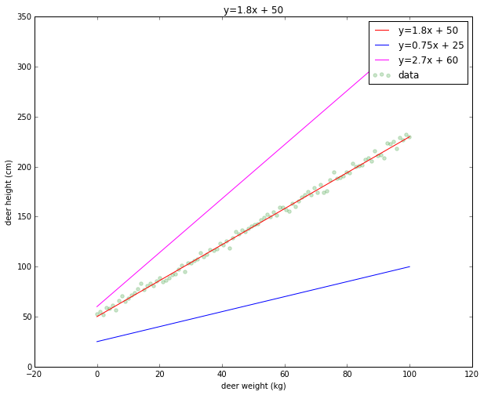
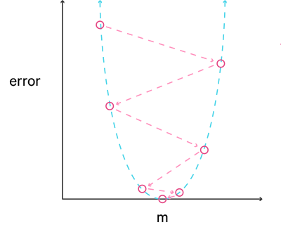
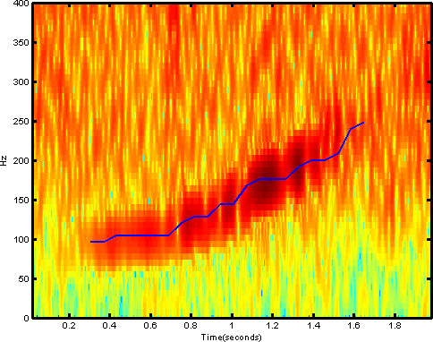

# ML101

Francis Tseng (@frnsys)

---

## What is "Machine Learning"?

An amalgamation of techniques & concepts from many different fields.

---

## What is "Machine Learning"?

"machine learning is about using algorithms to infer things from data"

`data -> algorithm -> answers (hopefully)`

...but vague...

---

## Motivation

What can you _do_ with ML?

- Predict things
- Automate things/make decisions
- Gain insight into a system
- Emulate a system

---

Getting more specific...

---

## Supervised Learning

- Provide the algorithm with input data and known answers (output) for each input
- The algorithm learns the relationship between the input and the output
- Returns a function which describes this relationship

---

## Describing the world in functions

Phenomena can be described mathematically, i.e. by some function.

For example, there is some relationship:

- between a house's size and its sale price
    - e.g. $\text{sales price} = 200 \times \text{square footage}$
- runner's speed and their finishing time, e.g.
    - e.g. $t = \frac{d}{s}$
- between a deer's weight and its height

---

Supervised machine learning algorithms try to uncover this function.

---

## Deer weight & height

Let's say we have the following data about deer heights and weights.

---

We also have the weights of some other deer but forgot to measure their height.

If we can uncover a relationship between deer weight and height, we could estimate the heights of the deer we forgot to measure.

---

This is a perfect opportunity for machine learning!

We can use _linear regression_, in which we just try to fit a line to the data we have.

(Remember that a line is just a representation of a function)

---

A line's function:

$$
y = mx+b
$$

- $m$ is the "slope"
- $b$ is the "intercept"
- $y$ is the "output" (what we want to predict)
- $x$ is the "input" (the data we want to predict from)

---

Together, $m$ and $b$ define how the line looks:

We say that $m$ and $b$ _parameterize_ the function ($m$ and $b$ are called "parameters").

---

Here:

- $y$ = deer height
- $x$ = deer weight
- $m$ = ???
- $b$ = ???

---

Using known deer weights and heights (called _training data_),
linear regression will learn $m$ and $b$ for us.

---

Some guesses at the best fit line:

It looks like $m=1.8, b=50$ fits best.

---

So our algorithm would give us $m=1.8, b=50$ back and thus we have learned the function:

$$
y = 1.8x + 50
$$

For relating a deer's weight to a deer's height.

This function is called the _hypothesis_, and we can now use it to estimate deer heights given deer weights.

---

Say we had a deer that weighed 70kg but wanted to know it's height. We just do:

$$
1.8(70) + 50 = 176\text{cm}
$$

---

## How does learning happen?

How does the algorithm come up with good values of $m$ and $b$?

---

It varies, but usually via a _cost_ or _objective_ function.

This tells the algorithm how "wrong" it is with its current guesses for $m$ and $b$ on the training data.

The algorithm iteratively tries different parameters (i.e. different guesses at the underlying function) until it can (approximately) minimize this error.

---

## Computing Crime Coefficients

The following example is based off of the show [_Psycho-Pass_](https://en.wikipedia.org/wiki/Psycho-Pass).

---

Say we live in a world where the government uses some equation to calculate a _crime coefficient_ for each individual (which measures how threatening someone is to society).

We want to reverse engineer this equation and learn how these crime coefficients are computed.

A friendly whistleblower has leaked us a dataset of crime coefficients, along with other values (features) we suspect are used to compute it:

[http://bit.ly/1euritd](http://bit.ly/1euritd)

---

This data set includes, among other things, the following:

- their latest __heart rate__ (people who are about to commit a crime are probably very excited/anxious)
- their __number of Facebook friends__ (people who have little connection to society have little interest in preserving it)
- whether or not they are __related to a criminal__ (because crime is genetic, amirite?)
- their known crime coefficient

With this data and the known crime coefficients (our training data), we can use a machine learning algorithm to learn the relationship between the features (heart rate, number of Facebook friends, and criminal relation) and the crime coefficients.

---

## [~ notebook time ~](http://nbviewer.ipython.org/github/ftzeng/ml101/blob/master/ml101.ipynb)

---

## The most important part of machine learning

The most critical part of all forms of machine learning is _representation_.

How do you take your phenomena or data and translate into a form which the computer can process? What are the important signals (features) that represent what we want to predict?

---

The process of coming up with a good representation for your problem is called _feature selection_ or _feature engineering_ (more art than science).

In our case, we used heart rate, criminal relation, and number of Facebook friends. But we could have used anything we had data for.

---

In a [machine learning competition for identifying whales by their sound](https://www.kaggle.com/c/whale-detection-challenge), Daniel Nouri framed the problem as one of image recognition.

He represented the audio as images (spectrograms) and performed extremely well on the challenge. (h/t Johann Diedrick)

---

## The other most important part of machine learning

- Data is a crude approximation
- A lot of human subjectivity is involved
    - We relied on a lot of stereotypes and conjecture for our crime coefficients

---

thanks

~ @frnsys